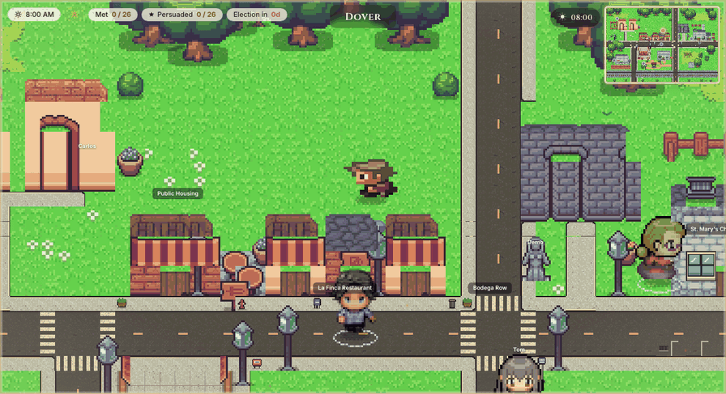
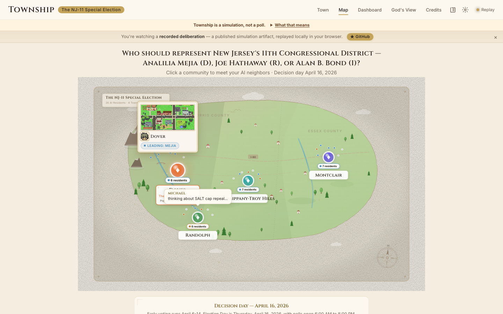
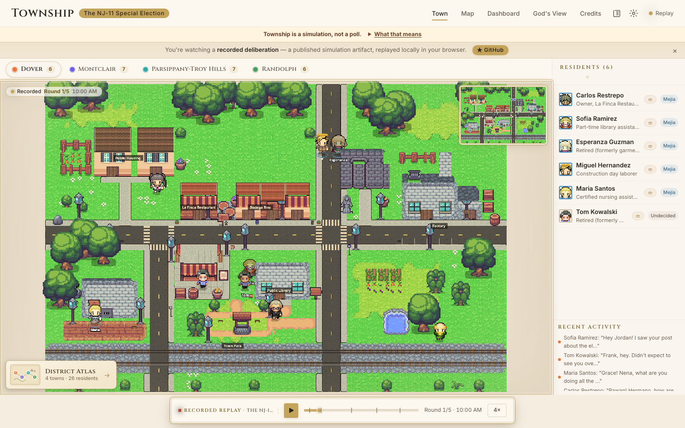
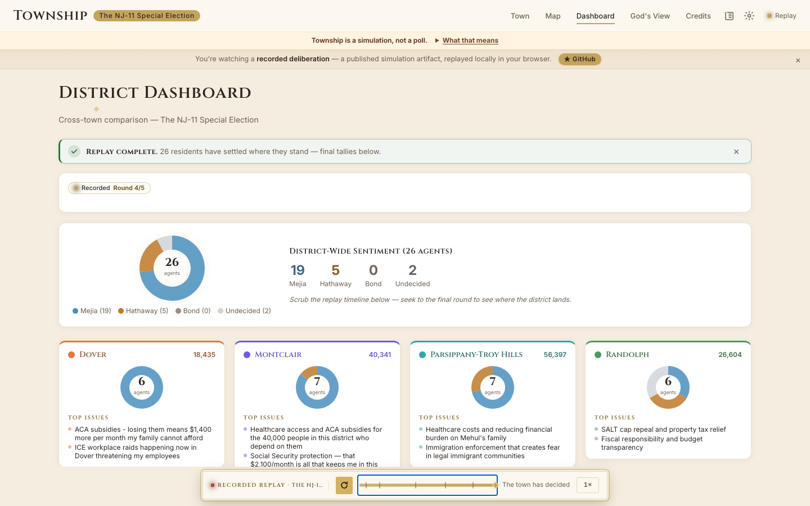
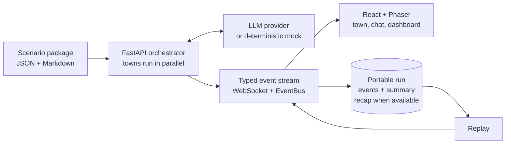

<p align="center">
  <picture>
    <source media="(prefers-color-scheme: dark)" srcset="docs/media/brand/lockup-dark.svg">
    
  </picture>
</p>

<p align="center">
  <strong>Put a civic question in a living pixel town. Watch AI residents reason, talk, disagree, and change their minds.</strong>
</p>

<p align="center">
  <a href="https://stevenwang-cy.github.io/township/"><strong>Explore the live demo</strong></a>
  ·
  <a href="docs/README.md">Read the docs</a>
  ·
  <a href="CONTRIBUTING.md">Add a resident or scenario</a>
</p>

<p align="center">
  <a href="https://github.com/StevenWang-CY/township/actions/workflows/backend.yml"></a>
  <a href="https://github.com/StevenWang-CY/township/actions/workflows/frontend.yml"></a>
  <a href="https://github.com/StevenWang-CY/township/actions/workflows/smoke.yml"></a>
  <a href="LICENSE"></a>
  <a href="https://stevenwang-cy.github.io/township/"></a>
</p>

<p align="center">
  <a href="https://stevenwang-cy.github.io/township/">
    
  </a>
</p>

Township is an open-source engine for making civic deliberation visible. A
scenario package defines the question, options, towns, fictional residents, local
context, and news beats. The Python engine runs a configurable sequence of
`seed → converse → news → opinion → decide`; a typed event stream brings every
walk, conversation, reaction, and opinion shift to a React + Phaser world.

It is designed for research, education, media literacy, and agent development.
It is also deliberately easy to inspect: personas are Markdown, scenarios are
JSON, runs are portable event logs, and a deterministic mock makes the complete
pipeline work without credentials or network access.

> [!IMPORTANT]
> **Township is a simulation, not a poll.** Its outputs do not measure real
> public opinion and must never be presented as if they do. Residents are
> fictional composites and every output is an LLM artifact. Read
> [Responsible Use](RESPONSIBLE_USE.md) before creating or publishing a
> real-world scenario.

<table>
  <tr>
    <td width="33%" align="center"><a href="https://stevenwang-cy.github.io/township/"></a></td>
    <td width="33%" align="center"><a href="https://stevenwang-cy.github.io/township/"></a></td>
    <td width="33%" align="center"><a href="docs/nj11-retrospective.md"></a></td>
  </tr>
  <tr>
    <td align="center"><strong>A scenario becomes a place</strong><br><sub>Towns, residents, options, context, and news live in one package.</sub></td>
    <td align="center"><strong>Deliberation becomes visible</strong><br><sub>Routines, weather, meetings, replay, and opinion shifts.</sub></td>
    <td align="center"><strong>The record stays inspectable</strong><br><sub>Portable evidence, cost accounting, and an honest retrospective.</sub></td>
  </tr>
</table>

## Why Township

- **A world, not a spreadsheet.** Residents follow routines through distinct
  towns, meet at local landmarks, speak in-world, react to news, and carry their
  changing stance into a district dashboard.
- **Scenario-first by construction.** Candidates, budget choices, places,
  personas, and news live under `scenarios/<id>/`—never hardcoded in the engine.
- **Zero-key from the first clone.** The deterministic mock exercises every
  phase and powers offline tests. The Pages demo replays committed runs with no
  backend and no API calls.
- **Live and replay share one path.** Both publish the same discriminated event
  union, so a saved run drives the same pixel town and charts as live inference.
- **Bring the model you trust.** Bedrock, Anthropic, OpenAI, OpenRouter, Ollama,
  LM Studio, and the built-in mock implement one provider contract.
- **Runs are research artifacts.** Successful best-effort persistence publishes a
  complete event log and structured summary under `runs/`, plus a narrative recap
  when recap generation succeeds.
- **Human-readable agents.** Each resident is one Markdown file with structured
  frontmatter, prose voice, routines, concerns, goals, and relationships.

### Meet a few residents

These fictional composites are authored as people rather than demographic rows.
Their pixel portraits are cropped from the same directional sprite sheets that
walk through the live town.

<table>
  <tr>
    <td align="center"><br><sub>Carlos<br>Restrepo</sub></td>
    <td align="center"><br><sub>Maria<br>Santos</sub></td>
    <td align="center"><br><sub>Miguel<br>Hernandez</sub></td>
    <td align="center"><br><sub>Rosa<br>Chen</sub></td>
    <td align="center"><br><sub>Jordan<br>Williams</sub></td>
    <td align="center"><br><sub>Vikram<br>Iyer</sub></td>
    <td align="center"><br><sub>Jen<br>Russo</sub></td>
    <td align="center"><br><sub>Mike<br>Brennan</sub></td>
    <td align="center"><br><sub>Frank<br>DeLuca</sub></td>
  </tr>
</table>

## Try it in two minutes

Requirements: Python 3.11+ and Node `^20.19.0` or `>=22.12.0`.

```bash
git clone https://github.com/StevenWang-CY/township.git
cd township
make install
SCENARIO=millbrook-budget make demo
```

Open [localhost:8001](http://localhost:8001). `make demo` builds and serves the
complete app with the deterministic mock provider: offline, free, and with no
`.env` file required. Use `make dev` instead when you want backend/frontend hot
reload on ports 8001 and 5173. If [`uv`](https://docs.astral.sh/uv/) is installed,
`make install` honors the committed lock exactly; pip remains the supported
fallback.

Prefer the terminal?

```bash
township run --scenario millbrook-budget --provider mock
```

That command runs the full deliberation and, when the best-effort finalization steps
succeed, prints a recap and leaves a portable artifact in `runs/<run_id>/`. Useful
next commands:

```bash
township scenarios
township replay --demo --scenario nj11-2026
township serve --scenario millbrook-budget --provider mock
```

The Python wheel is intentionally API/headless-only; it includes the CLI and
scenario packages, not the compiled web UI. Use the Docker image for a packaged
full application, or run the frontend from this source checkout.

The [hosted demo](https://stevenwang-cy.github.io/township/) is a static replay
player. It makes zero network model calls and clearly labels recorded runs; use a
local backend for live chat, new simulations, voice, and God's View injections.

## What you can explore

| Surface | What it reveals |
|---|---|
| **Living town** | The landing view: routines, weather, time of day, conversations, gossip, gestures, and opinion ripples rendered in Phaser |
| **District atlas** | Each town's setting, cast, demographics, and live balance of agent stances |
| **Resident chat** | In-character conversation with private relationship context, trust, voice hooks, and a capability-protected personal journal |
| **Dashboard** | Cross-town patterns, issue fault lines, conversations, and stance trajectories |
| **God's View** | A transparent intervention sandbox for asking how agents react to a hypothetical development |
| **Replay timeline** | Pause, seek, change speed, or jump between rounds in a recorded run |

## How it works



The frontend's simulation timeline sees exactly what the event log sees; REST
supplies validated scenario vocabulary and explicit roster/town snapshots.
Pydantic event models in the backend mirror a TypeScript discriminated union in
the frontend, guarded by a contract test. That makes recorded, live, headless,
and visual runs different views of the same simulation—not separate products
that can silently drift.

Read the [architecture guide](docs/architecture.md) for the prompt pipeline,
wire contract, persistence model, cost accounting, and module-by-module tour.

## Author a civic world

Scaffold a package that already loads and lints:

```bash
township new-scenario school-boundary-vote
township new-agent school-boundary-vote townsville --name "Maya Brooks"
township run --scenario school-boundary-vote --provider mock
```

```text
scenarios/school-boundary-vote/
├── scenario.json              # question, options, rounds, news, town order
├── towns/*.json               # place, demographics, landmarks, map metadata
├── options/*.json             # arguments, positions, evidence, sources
├── agents/<town>/*.md         # fictional resident personas
├── context/*.json             # logistics or other shared evidence
└── god-scenarios.json         # optional intervention presets
```

The package can describe an election, a budget, a zoning hearing, a school-board
decision, or another shared civic choice. The engine does not know the names of
your towns or options. Start with the complete
[scenario format](docs/scenario-format.md), the
[persona authoring guide](docs/persona-authoring.md), or copy the fully annotated
[persona template](docs/persona-template.md).

## Providers

Set `LLM_PROVIDER` explicitly, or leave it unset and Township will detect a
configured credential before falling back—loudly—to `mock`.

| Provider | `LLM_PROVIDER` | Credential / endpoint |
|---|---|---|
| Deterministic mock | `mock` | None |
| AWS Bedrock | `bedrock` | `AWS_BEARER_TOKEN_BEDROCK` or the standard AWS credential chain |
| Anthropic API | `anthropic` | `ANTHROPIC_API_KEY` |
| OpenAI API | `openai` | `OPENAI_API_KEY` |
| OpenRouter | `openrouter` | `OPENROUTER_API_KEY` |
| Ollama | `ollama` | Local OpenAI-compatible endpoint |
| LM Studio | `lmstudio` | Local OpenAI-compatible endpoint |

Source/development installs and the Docker image include the OpenAI client. A plain
Python wheel install needs `pip install 'township[openai]'` before using OpenAI,
OpenRouter, Ollama, or LM Studio.

Concurrency, model IDs, prompt caching, endpoints, CORS, and deployment options
are documented in [Deployment](docs/deployment.md) and [`.env.example`](.env.example).
Secrets belong only in environment variables.

## Included scenarios

| Scenario | Cast | What ships |
|---|---:|---|
| **The Millbrook Surplus** | 8 residents · 2 towns | A fictional direct-democracy vote over a one-time $12M surplus, plus a zero-cost mock replay. It proves the engine is not election-specific. |
| **NJ-11 Special Election** | 26 residents · 4 towns | A retrospective of the certified April 2026 race, with a complete Bedrock/Claude replay and a published error analysis. |

### The shipped NJ run, without spin

The included NJ-11 replay contains **883 events**, **405 model calls**,
**1,501,405 metered token units**, and **zero failed agents**. Its provider usage
after generating the recap was **$7.3298**; the district summary, finalized just
before that last recap call, records **$7.3192**.

The 26 fictional characters ended at 19 Mejia, 5 Hathaway, 0 Bond, and 2
undecided. Those are **character states, not votes, percentages, a sample, or a
forecast**. The [NJ-11 retrospective](docs/nj11-retrospective.md) compares the
run with certified results and documents selection bias, consensus drift,
turnout blindness, and where the simulation failed. The exact event log is
[committed with the scenario](scenarios/nj11-2026/demo/simulation_cache.json), so
the claims are reproducible.

## Repository map

| Path | Purpose |
|---|---|
| `backend/core/` | Pydantic domain models, scenario/persona loading, wire DTOs, storage, EventBus |
| `backend/simulation/` | Multi-round loop, multi-town orchestration, replay, recap, run persistence |
| `backend/providers/` | Bedrock, Anthropic, OpenAI-compatible, local, and mock adapters |
| `backend/routes/` | Simulation, chat, God's View, scenarios, towns, journal, runs, voice |
| `frontend/src/game/` | Phaser world, resident sprites, clock, weather, routines, capture hooks |
| `frontend/src/components/` | Map, town, chat, journal, dashboard, replay player, accessibility controls |
| `scenarios/<id>/` | All domain-specific content and optional demo replay |
| `tests/` | Offline backend, provider, persona, scenario, CLI, replay, and wire-contract tests |

## Documentation

- [Documentation index](docs/README.md) — the shortest route to every guide
- [Architecture](docs/architecture.md) · [API](docs/api.md) · [Deployment](docs/deployment.md)
- [Scenario format](docs/scenario-format.md) · [Persona authoring](docs/persona-authoring.md)
- [FAQ](docs/faq.md) · [Roadmap](ROADMAP.md)
- [Responsible Use](RESPONSIBLE_USE.md) · [Security](SECURITY.md)
- [Third-party art and font notices](THIRD_PARTY_NOTICES.md)

## Contributing

Personas are the best first contribution: they need empathy and local texture,
not Python. Scenarios add whole new civic worlds. Engine, research, frontend, art,
accessibility, and documentation work are equally welcome.

Read [CONTRIBUTING.md](CONTRIBUTING.md), choose a
[`good first issue`](https://github.com/StevenWang-CY/township/issues?q=is%3Aissue+is%3Aopen+label%3A%22good+first+issue%22),
or propose a [new resident](https://github.com/StevenWang-CY/township/issues/new?template=new_persona.yml)
or [scenario](https://github.com/StevenWang-CY/township/issues/new?template=new_scenario.yml).
Community participation follows the [Code of Conduct](CODE_OF_CONDUCT.md).

## Citation, license, and provenance

Township is released under the [MIT License](LICENSE). Cite the software using
[`CITATION.cff`](CITATION.cff); academic work building on its generative-agent
architecture should also cite Park et al., *Generative Agents* (UIST 2023), as
recorded in that file.

Vendored and derivative pixel assets remain subject to their asset-specific
licenses and documented provenance qualifications. Every source, modification,
and license is listed in [THIRD_PARTY_NOTICES.md](THIRD_PARTY_NOTICES.md). Press and project media include
the [social preview](docs/media/social-preview.png) and the
[brand kit](docs/media/brand/README.md).

---

<p align="center">
  <strong>Build a town worth listening to.</strong>
</p>
