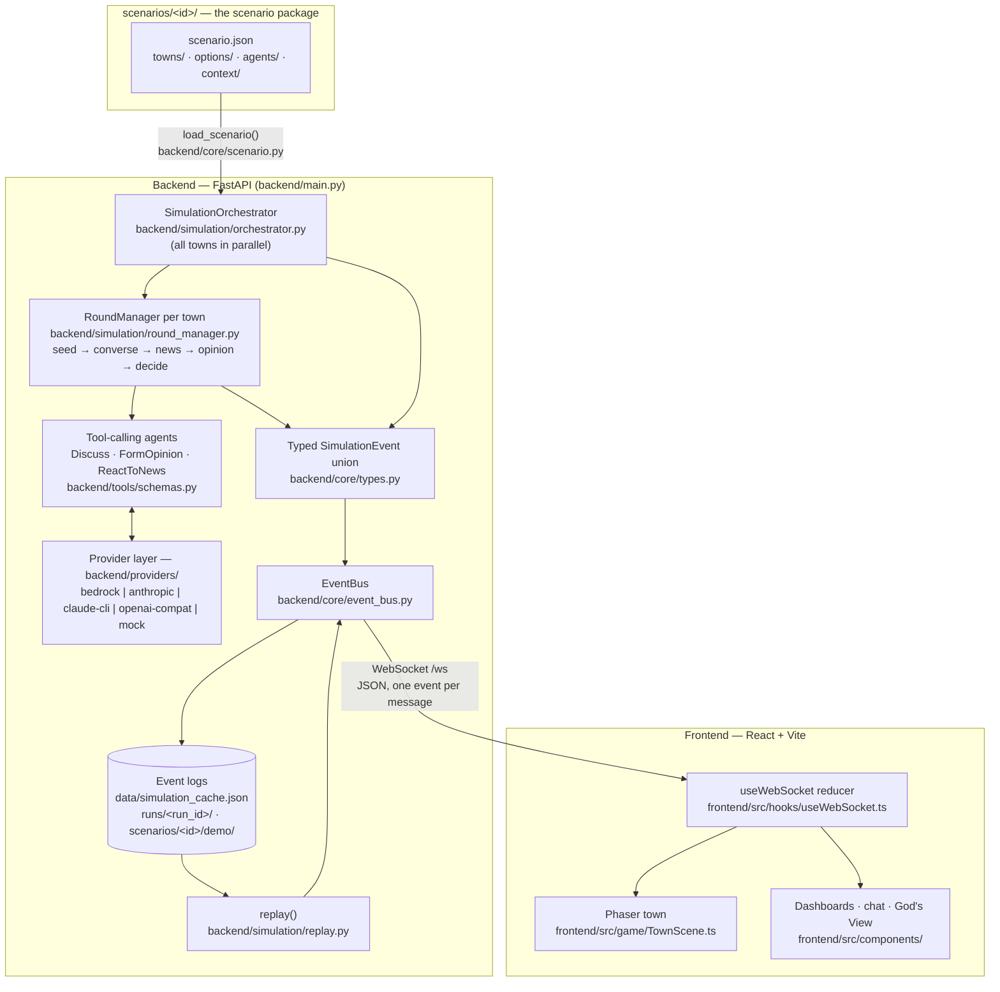

# Architecture

Township is a pipeline with one direction of truth: a **scenario package** (data) drives a **simulation engine** (Python), which emits a **typed event stream** that a **React + Phaser frontend** renders. Deliberation semantics come from the package — swap the scenario directory and the same engine handles a town budget instead of a congressional race. A town may explicitly select scenario-namespaced Tiled art in its own JSON; without that metadata the same landmark payload drives the procedural renderer. Everything below is grounded in the actual modules; file paths are given so you can read the source next to this page.

```mermaid
flowchart TB
    subgraph pkg["scenarios/&lt;id&gt;/ — the scenario package"]
        SJ["scenario.json<br/>towns/ · options/ · agents/ · context/"]
    end

    SJ -->|"load_scenario()<br/>backend/core/scenario.py"| ORCH

    subgraph backend["Backend — FastAPI (backend/main.py)"]
        ORCH["SimulationOrchestrator<br/>backend/simulation/orchestrator.py<br/>(all towns in parallel)"]
        RM["RoundManager per town<br/>backend/simulation/round_manager.py<br/>seed → converse → news → opinion → decide"]
        TOOLS["Tool-calling agents<br/>Discuss · FormOpinion · ReactToNews<br/>backend/tools/schemas.py"]
        PROV["Provider layer — backend/providers/<br/>bedrock | anthropic | claude-cli | openai-compat | mock"]
        EV["Typed SimulationEvent union<br/>backend/core/types.py"]
        BUS["EventBus<br/>backend/core/event_bus.py"]
        RUNS[("Event logs<br/>data/simulation_cache.json<br/>runs/&lt;run_id&gt;/ · scenarios/&lt;id&gt;/demo/")]
        REPLAY["replay()<br/>backend/simulation/replay.py"]
    end

    ORCH --> RM
    RM --> TOOLS
    TOOLS <--> PROV
    RM --> EV
    ORCH --> EV
    EV --> BUS
    BUS --> RUNS
    RUNS --> REPLAY
    REPLAY --> BUS

    BUS -->|"WebSocket /ws<br/>JSON, one event per message"| RED

    subgraph frontend["Frontend — React + Vite"]
        RED["useWebSocket reducer<br/>frontend/src/hooks/useWebSocket.ts"]
        PHASER["Phaser town<br/>frontend/src/game/TownScene.ts"]
        DASH["Dashboards · chat · God's View<br/>frontend/src/components/"]
    end

    RED --> PHASER
    RED --> DASH
```

Two things to notice. First, live simulation transitions reach the frontend through
the same event stream used by replay, which is why a replayed run is
indistinguishable from a live one. REST supplies bootstrap vocabulary and explicit
snapshots such as the town roster; it does not bypass the event stream with hidden
simulation transitions. Second, every module that wants to announce a transition
publishes an event through `EventBus`.

## Component tour

**Scenario loader — `backend/core/scenario.py`.** Validates `scenario.json` against the Pydantic `ScenarioConfig`, loads towns, per-option rich data, `context/` extras, God's View presets, and the persona roster, and cross-checks everything (contiguous round plan, known news ids, persona stances/relationships/goals, town references, safe package paths). Malformed JSON and invalid known context shapes fail the package load; they are never skipped. Optional town-map metadata must point exactly to `assets/maps/<scenario>/<town>.tmj` and its namespaced preview. The runtime `Scenario` object is the single source of truth the rest of the engine queries — stance ids, colors, labels, prompt context blocks, and `build_full_context()`, the seed-round briefing. `validate_stance()` coerces any model-produced stance string onto the roster so one hallucinated option can never corrupt a summary or the wire. The full package spec is in [scenario-format.md](scenario-format.md).

**Orchestrator — `backend/simulation/orchestrator.py`.** `SimulationOrchestrator` owns runtime state: one `AgentState` list per town, built from the scenario's persona definitions. `run_full_simulation()` announces the roster (`simulation_started`) and advances towns in parallel inside a deterministic outer round barrier: weather is emitted for the round, each active town completes that round through its own `RoundManager`, then configured cross-town gossip lands before any town advances again. When the rounds finish it aggregates a `DistrictSummary` (prediction percentages, consensus zones, fault lines, total cost), emits `simulation_ended`, and attempts cache/run finalization without making paperwork failure retroactively fail the deliberation (see [Runs, recap, replay](#runs-recap-and-replay)). It also implements God's View: inject a development into every agent, collect `ReactToNews` responses, and re-run `FormOpinion` for anyone actually moved. Simulation, replay, and injection share one admission reservation so their mutations and event histories cannot overlap.

**RoundManager — `backend/simulation/round_manager.py`.** The core loop, one instance per town. It walks the run's plan — the scenario's `round_plan` for the `quick` preset, the expanded campaign calendar otherwise — and dispatches each beat's phases in order: `seed` (full briefing → initial opinion), `converse` (pairs chosen by a seeded, relationship-aware matching — declared ties, shared concerns, the same stance and voice-with-voice pull people together, last beats' partners are pushed apart — meeting where their routines put them at the beat's clock, 3-exchange conversations), `news` (inject beats, collect reactions), `opinion` and `reflect` (re-form opinion from a digest of what happened since the last one, citing it), `decide` / `vote` (ballots, spread across election-day beats by turnout), `results` and `aftermath`. Voices call the model; neighbors take every phase through the influence ledger and a templated grammar (see [The neighbors tier and presence](#the-neighbors-tier-and-presence)). Every phase both mutates agent state (memories, ledger, opinions) and publishes events. A provider error marks the agent `ERROR` rather than minting a confident fake opinion.

**Tool schemas — `backend/tools/schemas.py`.** Agents never free-associate their decisions; they call typed tools. `build_tools(scenario)` produces the per-scenario registry: `Discuss` (response, sentiment, key takeaway, gesture), `FormOpinion` (whose `candidate` enum *is* the scenario's stance roster), `ReactToNews` (emotional response, impact on stance), and the scenario-independent `ClassifyInteraction` used by player chat to adjust trust.

**Provider layer — `backend/providers/`.** `base.py` defines the narrow `LLMProvider` protocol every backend satisfies: `call_agent(system_prompt, messages, tools, max_tokens, model) -> {text, tool_use, tokens, cost, stop_reason}`, plus usage reporting. `factory.py` selects the implementation: explicit `LLM_PROVIDER` wins; otherwise auto-detect from whichever credential is present (`ANTHROPIC_API_KEY` → anthropic, `AWS_BEARER_TOKEN_BEDROCK` → bedrock, `OPENAI_API_KEY` → openai, `OPENROUTER_API_KEY` → openrouter), then from a `claude` CLI on PATH (→ claude-cli; `TOWNSHIP_NO_CLI_AUTODETECT=1` skips this step, and the test suite sets it); with neither it falls back — loudly — to the deterministic mock, so a fresh clone runs the whole pipeline offline. `claude_cli.py` is the project's real provider: Claude through the user's Claude subscription instead of an API key, one `claude -p --output-format json` subprocess per call, with the system prompt on `--system-prompt`, the rendered transcript on stdin, and the chosen tool's input schema on `--json-schema`, so the CLI's `structured_output` becomes the tool call. Transient failures retry with 2/15/60 s backoff, usage-limit messages pause the provider (`status()` reports `paused`/`until`), `cost` stays 0.0 with the CLI's API-equivalent price kept as `equivalent_cost_usd`, and the default fan-out is four concurrent processes. Errors come back as a `stop_reason: "error"` dict, never an exception, so one flaky call degrades one agent instead of a run.

**EventBus — `backend/core/event_bus.py`.** A small async pub/sub hub. `publish()` appends to a capped 5,000-event diagnostic tail, notifies typed and wildcard subscribers, and forwards the JSON-serialized event to every registered WebSocket. Separately, it retains the complete current/latest run from `simulation_started`; subscribing a socket atomically replays that history before live delivery, so a late join cannot miss the roster or arrive half-hydrated. The orchestrator's unbounded per-run recorder—not the diagnostic tail—is the persistence source. Per-socket locks preserve order and prevent a publish racing hydration from arriving twice; dead sockets are pruned on send failure. The `/ws` endpoint in `backend/main.py` checks browser origins against `ALLOWED_ORIGINS`, then subscribes the socket and runs a ping/pong keepalive loop; native clients without an `Origin` header remain supported.

**Wire DTOs — `backend/core/wire.py`.** Converters from internal Pydantic models to the exact dict shapes the frontend's TypeScript interfaces expect (`agent_state_to_wire`, `town_summary_to_wire`, `district_summary_to_wire`, ...). This is the single place the wire shape is defined on the backend; if the frontend interface changes, these converters change — not the internal types.

**Routes — `backend/routes/`.** `scenario.py` (the bootstrap payload: question, options, towns, colors, map metadata), `simulation.py` (start/status/results/agents, replay, latest recap), `runs.py` (list/inspect/export persisted runs), `towns.py` (validated town JSON served so backend and Phaser share coordinates), `chat.py` (live in-character player chat with private trust tracking), `gods_view.py` (injections + curated presets), `journal.py`, `transcribe.py`, `tts.py`. `backend/main.py` wires them up, owns the singletons (`EventBus`, provider, `Scenario`, orchestrator) on `app.state`, and serves the built frontend at `/` when `frontend/dist` exists.

**CLI — `backend/cli.py`.** The `township` command (installed by `make install` via `pyproject.toml`): `serve` (uvicorn with `SCENARIO`/`LLM_PROVIDER` set for you), `run` (headless simulation with per-round progress, prediction, recap, and the run directory printed), `replay` (a persisted run or a scenario's demo cache, rendered to the terminal), `scenarios` (list and health-check every package), and the `new-scenario` / `new-agent` scaffolds.

**Frontend.** `frontend/src/hooks/useWebSocket.ts` opens `/ws` (auto-reconnect, 3 s backoff) and folds every public event into one `useReducer` store: agent map, conversations, town summaries, world clock, weather, and a rolling 500-event buffer. Capability-protected relationships travel only in the initiating chat response and are synchronized locally by `useRelationships`; journals use the same browser capability. `frontend/src/context/ScenarioContext.tsx` fetches `GET /api/scenario` once and provides option colors/labels, map metadata, and `decision_kind`-aware wording to every component. `frontend/src/game/TownScene.ts` loads authored art only when the town declares its scenario-qualified `.tmj`; otherwise it builds a complete scene from `GET /api/towns` landmarks. Residents walk `agent_moved` coordinates along A* paths over a nav grid built from the map's collision layer and ground kinds (`NavGrid.ts`) — sidewalks, paths, parking lots and painted crossings are cheap, open asphalt is dear, and street furniture never pads a pavement cell shut — so they cross where the paint is; every shipped town passes a pavement audit (each door, standing spot and edge portal reaches every other without touching the street), which `e2e/crowd.spec.ts` asserts. They arrive at landmark doors rather than geometric centres, and take day-part poses from the place and the hour (`DayPart.ts`). `Conversations.ts` choreographs a conversation as a scene — participants walk into formation, speakers lean and listeners nod, a topic strip and a takeaway card frame the exchange, and the group disperses when it ends. Speech bubbles carry the line's sentiment in their ink; opinion rings are drawn per confidence tier (`lib/stance.ts`) so only a real flip earns confetti; `news_reaction` events play as pixel reactions on the resident. `CivicLayer.ts` dresses the map's civic anchors from one derived environment (`lib/election.ts`: the round plan plus the reducer's raw signals): yard signs and banners take colour once opinions are public, the notice board pins headlines, the polling place opens for the decide phase and residents process to the ballot box, and results hang bunting and post a tally. Every one of these is re-derived silently on a replay seek. React components (`TownView`, `Dashboard`, `GodsView`, `ChatPanel`) render the same public stream plus their explicitly scoped local state.

**Private player state.** Township has no account system, so a random browser-held capability authorizes one `user_id`; only its SHA-256 digest is stored. A first binding is persisted before a relationship or journal can be created, and each private mutation is atomically durable before the endpoint acknowledges success. Capability, relationship, and journal files are validated strictly at startup. Corruption or a required write/migration failure locks the entire private subsystem closed. Upgrade records that lack a capability binding have no defensible owner, so startup removes them from the active store and writes a server-local `*.legacy-unbound.json` quarantine that no route reads.

## The wire contract

Every event is a Pydantic model in `backend/core/types.py` with a `Literal` `type` field, unioned as `SimulationEvent`. The frontend mirrors the union in `frontend/src/types/messages.ts` and consumes it in the `useWebSocket` reducer. All events flow backend → frontend over `/ws`, one JSON object per message.

| Event `type` | Published by | One line |
|---|---|---|
| `simulation_started` | orchestrator | A run begins — carries the full agent roster (wire `AgentState` dicts) and town list; the reducer rebuilds its agent map from it |
| `round_started` | RoundManager | A town enters round *N* of *M* |
| `world_clock_tick` | RoundManager | The round's in-game `clock` (`HH:MM`) — cosmetic day/night on the frontend |
| `agent_moved` | RoundManager | An agent walks to a landmark; `x`/`y` drive the Phaser tween |
| `conversation_started` | RoundManager | A 3-exchange conversation opens — carries the wire `Conversation` (participants, location, topic) |
| `agent_speech` | RoundManager | One utterance (truncated to 150 chars) with sentiment and an optional gesture — becomes a speech bubble |
| `conversation_ended` | RoundManager | Closes a conversation with the joined key-takeaway summary |
| `news_injected` | RoundManager | A scenario news beat lands (headline + description) |
| `news_reaction` | RoundManager | One agent's structured reaction (emotion, impact on stance, reasoning) — feeds the dashboard/news ticker |
| `opinion_changed` | RoundManager, orchestrator | Old vs. new `Opinion` — drives opinion rings, ripples, and every chart |
| `cross_town_gossip` | RoundManager | A takeaway crossing towns (emitted in both directions) — the gossip toast in the receiving town |
| `round_ended` | RoundManager | Round complete — carries wire `TownSummary` dicts for the HUD/timeline |
| `weather_changed` | orchestrator | District-wide weather from the scenario's `weather_schedule` (`clear`/`cloudy`/`rain`/`snow`/`fog`) |
| `god_view_injection` | orchestrator | A God's View development was announced to all agents |
| `gods_view_result` | `routes/gods_view.py` | The batch of wire-format reactions after an injection |
| `relationship_update` (legacy) | never published | Deprecated compatibility model; EventBus, persistence, export, and replay all deny it because player trust is capability-protected HTTP state |
| `ballot_cast` | RoundManager | A resident voted (option null = abstained) with a confidence and a one-line reason — election day, spread across its beats |
| `election_result` | RoundManager, orchestrator | A town's count as it reports, then the district roll-up (tallies, turnout, winner) |
| `simulation_ended` | orchestrator | The run is over — carries the wire `DistrictSummary` (with `election`, the swing residents and the cross-town themes) |

Additive fields ride on existing events: `round_started` and `world_clock_tick` carry the campaign `day`, `date`, `weekday`, `beat` and `label`; `simulation_started` carries the run's `preset` and `plan`; `opinion_changed` carries `round`, `trigger`, `influences`, `reason` and `delta_confidence`; `agent_moved` carries `home_town` (the move's `town` is where it happens — a commuter's host town); the agent wire carries `tier` and `home_town`; `news_injected` carries `news_id` and `towns`. Recordings made before a field existed replay unchanged.

**The guard: `tests/test_wire_contract.py`.** Renaming an event field "just on the backend" is the classic way this architecture rots, so the contract is tested from both sides: every backend `type` literal (extracted from the `SimulationEvent` union at runtime) must be declared in `messages.ts`; every user-visible event must have an explicit `case` in the `useWebSocket` reducer (not just the catch-all); and the legacy pre-rename event names (`agent_move`, `speech_bubble`, ...) must never reappear. It runs in `make test` with no API keys. The rule it enforces: **change both sides together, then run the test** — never one side casually.

`backend/simulation/replay.py` keeps a third copy of the type list (`EVENT_TYPE_MAP`, string → model class) so persisted event dicts can be deserialized back into typed events; a new event type isn't replayable until it's added there too. The shared `PRIVATE_EVENT_TYPES` policy drops denied types at EventBus, persistence, export, static staging, and replay boundaries. More importantly, replay/export requires explicit current schema and privacy markers: an unversioned artifact is refused wholesale because private influence embedded in ordinary speech or reasoning cannot be recovered by filtering event types.

## Prompt assembly

Every simulation call to an agent uses the same system prompt, composed fresh each time by `RoundManager._build_agent_system_prompt`:

1. **Persona body** — the markdown below the frontmatter in `agents/<town>/<slug>.md`, verbatim. This stable prefix is usually the largest single section.
2. **`--- CONTEXT ---`** — the scenario's `context_md` framing block.
3. **`--- YOUR RECENT EXPERIENCES ---`** — the agent's 10 most recent memories: one-line records of conversations, news reactions, and opinion updates written by earlier phases.
4. **`--- YOUR CURRENT STANCE ---`** — the latest `Opinion` (stance, confidence, reasoning, top issues, dealbreaker), when one exists.
5. **`--- YOUR GOAL THIS ROUND ---`** — the persona's `goals["round_<n>"]` entry, when the frontmatter declares one.
6. **`--- INSTRUCTIONS ---`** — a fixed stay-in-character block ("You can change your mind if you hear compelling arguments. Be authentic — if you're confused or torn, say so.").

The user message supplies the phase-specific task — the seed round additionally packs `Scenario.build_full_context()` (every option's positions, endorsements, debate excerpts, logistics) into it. Chat and God's View use a shorter variant (`orchestrator._build_god_view_prompt`) built on `context_short_md` and 5 memories.

## Cost and caching

**Whole-system-block prompt caching is experimental and off by default.** The shared Anthropic-family implementation (`backend/providers/base.py::_AnthropicFamilyProvider`, used by both the Bedrock and Anthropic API providers) can wrap the system prompt in a content block with `cache_control: {type: "ephemeral"}`. The block also contains changing memories, stance, and round goals, so an otherwise stable persona prefix does not guarantee a cache hit. Enable with `BEDROCK_CACHE_SYSTEM=1` or `ANTHROPIC_CACHE_SYSTEM=1` only after measuring representative usage; the shipped paid run recorded cache writes but zero reads.

**UsageTracker.** Every provider funnels token counts (input, output, cache reads, cache writes) and per-call cost into a shared `UsageTracker` (`backend/providers/base.py`). Costs come from the `MODEL_COSTS` catalog (with `COST_ALIASES` mapping Bedrock inference-profile ids and dated API ids onto canonical keys). Unknown OpenAI-compatible and local models report 0.0; an unknown Anthropic-family id uses the Sonnet catalog rate as an explicit estimate. In either case, verify the provider's current pricing before a paid run. The report surfaces everywhere you'd look for it: `GET /api/health`, `GET /api/simulation/status`, the `total_cost` field on the `DistrictSummary`, the `usage` block of every persisted run's `summary.json`, and the cost line `township run` prints at the end.

## Runs, recap, and replay

Pre-compute + replay is a first-class path, not a demo hack. Replayable documents
share the envelope `{"schema_version": 1, "privacy_version": 1, "events": [...]}`:

- **`data/simulation_cache.json`** — the latest run's public event log, replaced atomically as a best-effort finalization step.
- **`runs/<YYYYMMDD-HHMMSS>-<scenario-slug>-<random>/`** — the permanent record, persisted best-effort by `orchestrator._finalize_run()`. `events.json` and `summary.json` (district summary, usage, counts, responsible-use notices, optional recap field) are written in a private staging directory, then the entire complete directory becomes visible in one same-filesystem rename. `recap.md` exists only when recap generation succeeds. Browse current artifacts via `GET /api/runs`, fetch one with `GET /api/runs/{run_id}`, or download a self-contained shareable bundle with `GET /api/runs/{run_id}/export`.
- **`scenarios/<id>/demo/simulation_cache.json`** — a scenario's shipped demo replay (see [scenario-format.md](scenario-format.md#demo-replay-cache-demosimulation_cachejson--optional)).

`POST /api/simulation/replay` resolves its source in that order of explicitness — `cache_path` (project-root-anchored, traversal-rejected) > `run_id` > the active scenario's demo — checks the artifact versions and event envelope, then `backend/simulation/replay.py` deserializes each event and re-publishes it through the EventBus with per-type pacing (`speed` is a multiplier). Because replay re-enters the exact pipeline live events use, the frontend cannot tell the difference. Unversioned runs/caches are refused rather than “upgraded”: versions predating the private-player boundary may carry private influence in fields no type filter can identify. Static demo staging enforces the same gate before publication.

The **recap** (`backend/simulation/recap.py`) is the run's optional narrative: one provider call turns the real data — final distribution per town, the biggest stance swings mined from `opinion_changed` events, the meatiest conversation takeaways — into a 250–350-word markdown story with a headline. Expected provider failures use a deterministic template with the same real numbers; an unexpected finalization failure is logged and may leave `recap_markdown: null` with no `recap.md`. Either way, a completed deliberation is never failed by its own paperwork. When available, read it via `GET /api/simulation/recap`, `runs/<id>/recap.md`, or `township run` output.

## The campaign calendar

A scenario's optional `campaign` block (start and election dates, beat templates per weekday, scheduled news, events, weather) is expanded by `backend/simulation/calendar.py::expand_campaign` into a flat list of `RoundSpec`s — the same shape the quick plan uses, each carrying its day, date, weekday, beat and label. The `quick` preset is the scenario's `round_plan` verbatim; `campaign` is the calendar; `--days N` slides the start so the election still lands; `--until-election` drops the aftermath. The orchestrator paces beats for a live viewer (`TOWNSHIP_BEAT_PAUSE_S`, six seconds at 1× on the API, 0 for the CLI and tests), honours the run control (pause, resume, speed, skip to the next day), checkpoints every day's end under `runs/<id>/checkpoints/` (every agent's state, ledger and memories, the event cursor, the plan) with a day rollup beside it, and resumes from one with `--resume <run_id>` or `POST /api/simulation/start {"resume": ...}` — the resumed run appends to the same event log. The budget guard (`budget.py`) estimates the next beat from the running mean cost and stops a paid run cleanly at `--budget`/`LLM_BUDGET_USD`; the mock and the subscription CLI are free and never stop.

## The influence ledger and attribution

Every resident carries `Beliefs` (`backend/simulation/influence.py`): a utility per option from their issue weights and the options' authored `alignment`, party loyalty and declared lean; a ledger of every push with its cause. A conversation exchange pushes the listener toward the speaker's option by persuadability × trust (relationship, same town, same option) × the strength of the case on that issue, dismissed entirely past a bounded-confidence gap, halved when they already agree, softened when it cuts against their favourite, softer again each time the same person repeats the same case (habituation, refreshed on Sundays), scaled by what the town is talking about and by campaign attention (quiet early weeks, a loud final one). Headlines push through authored `effects` (procedural coverage is `neutral`); gossip is an exchange at a quarter gain. Between beats every ledger drifts a little toward its anchor — the persona, or the stance a voice stated at the seed. The read-out is the margin between the top two options: inside the undecided band the resident is undecided, outside it confidence grows with margin, evidence and a streak of stable days; fence-sitters seed at a near-tie so what they hear decides them, and in the last fifth of the calendar those who lean at all break with their lean. Ballots follow the margin, then party, then the declared lean, else abstain, under an authored turnout.

The mock renders its lines from the ledger's prior; real providers state their own stance and the ledger adopts it, recording the alignment. `attribution.py` builds the reflection digest a voice sees (what happened since their last opinion, bracketed ids to cite) and validates the citations that come back, filling from the ledger when the model cites nothing. On the wire, every `opinion_changed` carries `trigger`, `influences` and `reason`; for the flagship recording made before them, the player's reducer keeps what each resident heard and `frontend/src/lib/attribution.ts` derives the same shape (a partner who holds the new stance 0.6, a headline whose words show up in the reasoning 0.4, gossip 0.3), so the causal feed, the cards and the dashboard read the same either way.

## The neighbors tier and presence

A town of six voices is a cast, not a community. Each town also carries 12–18 **neighbors** — generated composites committed as scenario data (`agents/<town>/_neighbors.json`, produced by `township new-neighbors` from `community.json`'s per-town lean and name mixes and `backend/community/defaults.json`). They keep routines, talk in templated lines from `backend/community/grammar.py` (a sampled fraction reaches the wire; a conversation is staged only when a voice is in it), hear headlines, tick their opinion from the ledger (emitting only on a change of mind or a real swing) and vote — without ever calling a model. Tallies count everyone; `TownSummary.by_tier` keeps voices separable.

Before every beat the orchestrator builds a presence table: a routine stop written as `"<town-id>: <landmark>"` is a commute, a hosted event (debate, town hall, fair, rally) draws two voices and three neighbors from every other town, a market keeps everyone home; only beats with talk or news travel — seeds, opinions, ballots and tallies stay with the home town. A change of town is a world event (`agent_moved` to the host town with `home_town` set), so the scene watches commuters leave in the morning and return in the evening; conversations across home towns emit `cross_town_gossip` both ways and each side carries the topic home to retell.

## Demo feeds

A scenario ships one or more recordings under `demo/` (listed in `demo/manifest.json`); the static build stages every feed with a size budget, the player picks one with `?feed=<id>` or the replay bar's switcher, and seeks a long campaign from reducer checkpoints every 500 events. See [scenario-format.md](scenario-format.md#several-recordings-demomanifestjson--optional).

## Design decisions

| Decision | Choice | Why |
|---|---|---|
| Backend | Python + FastAPI | Native async for parallel towns and fan-out agent calls; Pydantic validation from scenario manifest to wire event |
| LLM access | Provider abstraction (`backend/providers/`) — Bedrock, Anthropic API, OpenAI-compatible (OpenAI/OpenRouter/Ollama/LM Studio), deterministic mock | One narrow `call_agent` contract; credential auto-detection; a zero-key clone runs end to end on the mock, and CI never needs a secret |
| Scenario content | Data packages under `scenarios/`, never code | The engine is scenario-agnostic; a new deliberation is a directory, not a fork |
| Agent personas | Markdown + YAML frontmatter | Git-trackable, reviewable in a diff, editable with no code; the body *is* the system prompt |
| Memory | Plain chronological list, no embeddings | For a 5-round arc, the 10 most recent memories fit in the prompt; a vector store would add infrastructure to approximate what recency already gives |
| Simulation delivery | Pre-compute + replay alongside live runs | Demo reliability and shareable runs; replay re-enters the same EventBus, so the frontend code path is identical. Chat and God's View stay live |
| Frontend state | One event reducer plus validated REST bootstrap/snapshots | The discriminated event union drives simulation transitions; scenario vocabulary and roster/town snapshots have explicit runtime validation and contract tests |
| Persistence | Plain JSON files, atomic file replacement, atomic run-directory publication | Runs are append-only artifacts and mutable state is small. Private writes are durable-before-ack and corruption fails closed; operators must provide writable durable storage |

One caveat worth quoting alongside any architectural pride: the pipeline faithfully renders whatever the models produce, and per [RESPONSIBLE_USE.md](../RESPONSIBLE_USE.md) —

> **Township is a simulation, not a poll.** Its outputs do not measure real public opinion and must never be presented as if they do.
> **The residents are fictional composites**, informed by public demographic data. No real resident is depicted.
> **Real public figures are represented through public source material**, summarized where necessary; verify the scenario's cited sources before relying on any claim.
> **Every output is an LLM artifact**, shaped by who wrote the personas and by the model's own biases.
